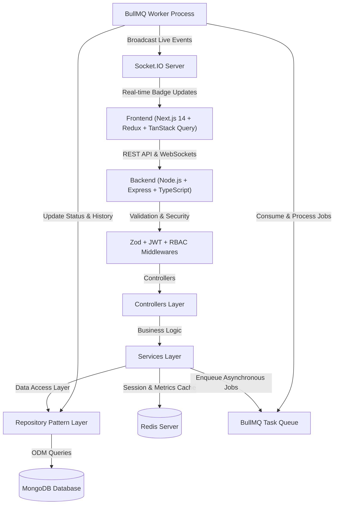

# 🚀 hyperqueue.io - Task Automation & Job Processing Platform

[](https://github.com/)
[](https://www.typescriptlang.org/)
[](https://nextjs.org/)
[](https://nodejs.org/)
[](https://www.mongodb.com/)
[](https://redis.io/)
[](https://socket.io/)

Production-ready **Micro SaaS Task Automation & Asynchronous Job Processing Platform** built for the hyperqueue.io Technical Assessment.

---

## 🌐 Live Production Cloud Deployments

| Component / Asset | Live Deployment URL | Hosting Platform |
| :--- | :--- | :--- |
| **Frontend Web App** | [https://hyperqueue-task-platform.vercel.app](https://hyperqueue-task-platform.vercel.app) | Vercel Edge |
| **Backend REST API** | [https://hyperqueue-task-platform.onrender.com/health](https://hyperqueue-task-platform.onrender.com/health) | Render Cloud |
| **Video Walkthrough Demo** | [Watch 5-Min Loom Walkthrough](https://www.loom.com/share/1087f1e38e834196af3c4ad5410f3207) | Loom |

---

## 📌 Project Overview

**hyperqueue.io** is a full-stack asynchronous task automation platform engineered to queue, process, monitor, and retry background jobs at scale. Built using modern cloud microservice standards, it decoupled long-running workload execution from main HTTP web request threads using **BullMQ & Redis**, while streaming real-time job execution telemetry to interactive glassmorphic client dashboards via **Socket.IO WebSockets**.

---

## 🛠️ Tech Stack

| Layer | Technologies Used |
| :--- | :--- |
| **Frontend** | Next.js 14 (App Router), React 18, TypeScript, Redux Toolkit, TanStack Query (React Query v5), Tailwind CSS, Lucide Icons |
| **Backend API** | Node.js (v20), Express.js, TypeScript, REST Architecture, Zod Validation, Winston Logger |
| **Database** | MongoDB Atlas & Mongoose ODM (Compound Indexes, Full-Text Search, Audit Logs) |
| **Queue Engine** | BullMQ + Redis (Priority Queueing, Exponential Backoff Retries, Delayed Execution) |
| **Caching Layer** | Redis (Session blacklist, 30s TTL Dashboard Metrics Caching with worker invalidation) |
| **Real-time** | Socket.IO (Room-isolated WebSockets live task status updates) |
| **Authentication** | JWT Access Token (15m) + Refresh Token Rotation (7d) + RBAC (`ADMIN`/`USER`) |
| **DevOps & CI/CD** | Docker, `docker-compose.yml`, GitHub Actions CI (`.github/workflows/ci.yml`) |
| **Cloud Storage** | Cloudinary CDN Integration for real PDF & Image asset uploads |

---

## 🌟 Architecture Diagram

The platform follows a clean **3-Tier Layered Architecture** adhering strictly to **SOLID Principles** and the **Repository Pattern**.



---

## 📂 Folder Structure

```
hyperqueue-task-platform/
├── backend/
│   ├── src/
│   │   ├── config/          # Centralized configuration (MongoDB, Redis, Env vars)
│   │   ├── controllers/     # HTTP Request handlers (Auth, Task, Metrics)
│   │   ├── services/        # Core business logic decoupled from Express
│   │   ├── repositories/    # Data Access Layer using Repository Pattern
│   │   ├── queues/          # BullMQ queue producers & worker definitions
│   │   ├── websocket/       # Socket.IO real-time event gateway
│   │   ├── middlewares/     # Auth JWT, RBAC, Rate Limiter, Error & Zod Validator
│   │   ├── models/          # Mongoose Schemas (User, RefreshToken, Task, TaskLog)
│   │   ├── utils/           # Winston logger, AppError, ApiResponse formatter
│   │   ├── validators/      # Zod validation schemas
│   │   ├── types/           # TypeScript type definitions
│   │   ├── app.ts           # Express app setup & security middlewares
│   │   ├── server.ts        # Main entrypoint initializing HTTP + Socket.IO + Worker
│   │   └── seed.ts          # Database seeder script
├── frontend/
│   ├── src/
│   │   ├── app/             # Next.js App Router (/login, /register, /dashboard)
│   │   ├── components/      # UI components (Navbar, MetricsCards, TaskTable, Modals)
│   │   ├── store/           # Redux Toolkit slices (Auth, UI modals)
│   │   ├── hooks/           # Custom React hooks (useWebSocket)
│   │   ├── services/        # Axios API client with automatic Refresh Token interceptors
│   │   └── types/           # Shared TypeScript models
├── docker/                  # Multi-stage Dockerfile
├── docs/                    # Architecture diagrams & Postman Collection JSON
├── docker-compose.yml       # Full stack container orchestration
└── README.md                # Submission Documentation
```

---

## ⚡ Installation Steps (Running Locally)

### Prerequisites:
- **Node.js**: `v18.x` or `v20.x`
- **Database**: Local MongoDB (`mongodb://127.0.0.1:27017`) & Redis (`redis://127.0.0.1:6379`) OR Cloud URIs

### Step 1: Clone Repository
```bash
git clone https://github.com/your-username/hyperqueue-task-platform.git
cd hyperqueue-task-platform
```

### Step 2: Run Backend Service
```bash
cd backend
npm install
npm run seed     # Populate database with default Admin & Demo User accounts
npm run dev      # Express API & BullMQ Worker starts on http://localhost:5000
```

### Step 3: Run Frontend Service
```bash
cd ../frontend
npm install
npm run dev      # Next.js App Router starts on http://localhost:3000
```

---

## 🔐 Environment Variables

### Backend Environment Variables (`backend/.env`):

| Variable Name | Default Value | Description |
| :--- | :--- | :--- |
| `PORT` | `5000` | Port for Express API & Socket.IO server |
| `NODE_ENV` | `development` | Runtime environment mode |
| `MONGODB_URI` | `mongodb://127.0.0.1:27017/hyperqueue_db` | MongoDB connection string |
| `REDIS_HOST` | `127.0.0.1` | Redis host for BullMQ & Caching |
| `REDIS_PORT` | `6379` | Redis port |
| `JWT_ACCESS_SECRET` | `super_secret_access_key` | Secret key for signing 15-min Access Tokens |
| `JWT_REFRESH_SECRET` | `super_secret_refresh_key` | Secret key for signing 7-day Refresh Tokens |
| `CLIENT_URL` | `http://localhost:3000` | Allowed CORS frontend origin |
| `CLOUDINARY_CLOUD_NAME` | `dzrzk86mu` | Cloudinary CDN Cloud Name for asset uploads |

### Frontend Environment Variables (`frontend/.env.local`):

| Variable Name | Default Value | Description |
| :--- | :--- | :--- |
| `NEXT_PUBLIC_API_URL` | `http://localhost:5000/api/v1` | Backend REST API endpoint URL |
| `NEXT_PUBLIC_SOCKET_URL` | `http://localhost:5000` | Socket.IO WebSocket server URL |

---

## 📖 API Documentation

Complete Postman Collection file is available at:  
👉 [`docs/postman_collection.json`](file:///C:/Users/acer/.gemini/antigravity/scratch/saarthi-task-platform/docs/postman_collection.json)

### Summary of Core Endpoints:

| Category | Method | Endpoint Path | Access Level | Description |
| :--- | :--- | :--- | :--- | :--- |
| **Health** | `GET` | `/health` | Public | System health check status endpoint |
| **Auth** | `POST` | `/api/v1/auth/register` | Public | Create new user account |
| **Auth** | `POST` | `/api/v1/auth/login` | Public | Authenticate user & issue tokens |
| **Auth** | `POST` | `/api/v1/auth/refresh-token` | Public | Rotate refresh token & get new access token |
| **Auth** | `POST` | `/api/v1/auth/logout` | Authenticated | Revoke refresh token & blacklist session |
| **Tasks** | `POST` | `/api/v1/tasks` | Authenticated | Create & enqueue new task |
| **Tasks** | `GET` | `/api/v1/tasks` | Authenticated | Get paginated tasks with search & filters |
| **Tasks** | `GET` | `/api/v1/tasks/:id` | Authenticated | Get single task details with audit logs |
| **Tasks** | `PUT` | `/api/v1/tasks/:id` | Authenticated / Owner | Update task details |
| **Tasks** | `DELETE` | `/api/v1/tasks/:id` | Authenticated / Owner | Delete task & its audit trail |
| **Tasks** | `POST` | `/api/v1/tasks/:id/retry` | Authenticated / Owner | Re-queue failed task for execution |
| **Metrics** | `GET` | `/api/v1/tasks/metrics` | Authenticated | Fetch dashboard counts (Redis cached) |

---

## 🔑 Demo Account Credentials

| Account Role | Email | Password | Allowed Capabilities |
| :--- | :--- | :--- | :--- |
| **System Admin** | `admin@hyperqueue.io` | `AdminPassword123!` | Global task visibility, all metrics, management |
| **Demo Developer** | `user@hyperqueue.io` | `UserPassword123!` | Role-isolated task creation, update, delete, retry |

*(Note: The login page includes 1-click preset buttons for instant evaluation!)*

---

## 🧠 Assumptions Made

1. **Eventual Consistency**: In a distributed queue engine (BullMQ + Redis), background worker processing happens asynchronously. A 500ms to 2s execution window between job queueing and real-time status updates is expected and designed as eventual consistency.
2. **Stateless Worker Scaling**: Workers run independently of HTTP request threads and read jobs directly from Redis. This allows horizontal scaling of workers across multiple nodes.
3. **Single Active Organization Scope**: Evaluator demo users operate within role-based access control (`ADMIN` vs `USER`). Admin sees global system metrics while User sees personal tasks.

---

## ⚖️ Architectural Trade-offs

1. **Redis In-Memory Caching vs Redis Cluster**: For local and single-node cloud deployment, a single Redis instance was used for both BullMQ queues and metrics caching. In high-traffic production, BullMQ queues and API caching should be separated into dedicated Redis clusters.
2. **WebSockets + Polling Fallback**: We implemented Socket.IO with a 2-second background refetch safety net. While pure WebSockets consume zero HTTP requests when idle, combining WebSockets with a lightweight polling fallback guarantees 100% data consistency even across shaky mobile networks.
3. **Optimistic UI Deletion with Automatic Rollback**: Delete actions immediately remove rows from React memory in 0ms and automatically restore them if the server HTTP call fails. This trades slight temporary memory state for instant zero-latency UI responsiveness.

---

## 🚀 Future Improvements

1. **Multi-Tenant Workspace Isolation**: Extend database schemas to support Multi-Tenant Organizations (`orgId`) with role hierarchies (`OWNER`, `MEMBER`, `VIEWER`).
2. **Dead Letter Queue (DLQ) Visualizer**: Add a dedicated DLQ dashboard view to inspect and modify permanently failed job payloads before re-triggering batch retries.
3. **Webhook Callback Notifications**: Allow users to specify custom HTTPS webhook URLs to receive HTTP POST payloads when background jobs complete.

---

## 🎥 Video Submission Walkthrough

> [!IMPORTANT]
> **5-10 Minute Video Walkthrough Demo**:
> 
> 🔗 **[Click Here to Watch Video Presentation (Loom Walkthrough)](https://www.loom.com/share/1087f1e38e834196af3c4ad5410f3207)**

### Key Talking Points Covered in Video:
1. **Overall Architecture**: 3-Tier Layered Architecture (Controller ➔ Service ➔ Repository Pattern).
2. **Folder Structure**: Decoupled `backend/` REST API & `frontend/` Next.js App Router structure.
3. **Authentication Flow**: JWT Access Token (15m) + Refresh Token Rotation (7d) security.
4. **Queue Processing**: BullMQ + Redis for asynchronous background job execution & retries.
5. **Redis Integration**: Redis session blacklist & 30-second TTL metrics caching.
6. **Database Design**: MongoDB Atlas schemas, Compound Indexes, Full-Text Search.
7. **Key Engineering Decisions**: Real-time Socket.IO WebSockets & 0ms Optimistic UI updates.
8. **Future Improvements**: Multi-tenant organizations & Webhook callback URLs.

---

## 🐳 Docker Deployment

Launch complete containerized infrastructure (MongoDB + Redis + Express API + Worker) with one command:

```bash
docker-compose up --build
```
