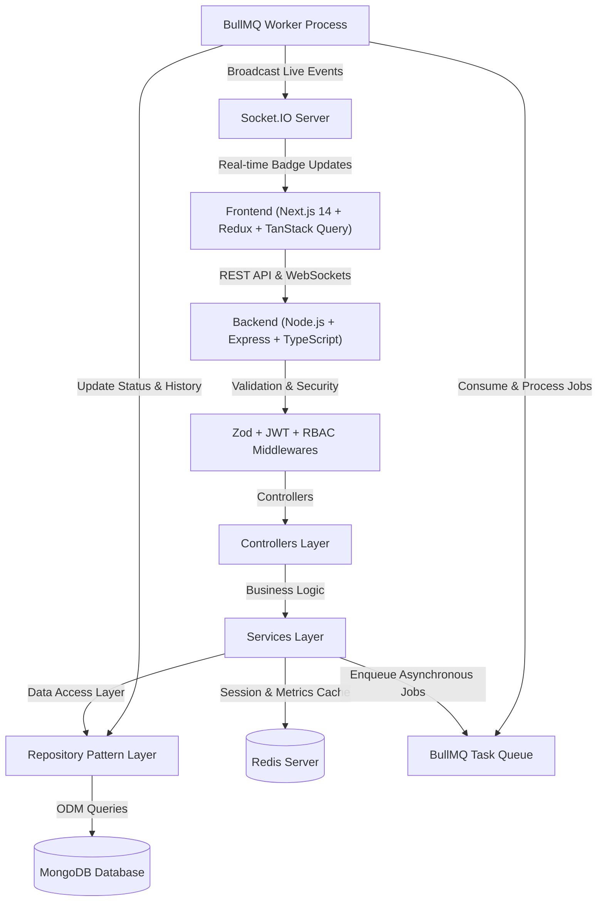

# 🚀 Saarthi AI - Task Automation & Job Processing Platform

[](https://www.typescriptlang.org/)
[](https://nextjs.org/)
[](https://nodejs.org/)
[](https://www.mongodb.com/)
[](https://redis.io/)
[](https://socket.io/)

Production-ready **Micro SaaS Task Automation & Asynchronous Job Processing Platform** built for Saarthi AI Technical Assessment.

---

## 🌟 Architecture Overview

The system follows a clean 3-Tier Layered Architecture adhering strictly to **SOLID Principles** and the **Repository Pattern**.



---

## 🛠️ Mandatory Technology Stack

| Layer | Technologies Used |
| :--- | :--- |
| **Frontend** | Next.js 14 (App Router), React.js, TypeScript, Redux Toolkit, TanStack Query, Tailwind CSS, Lucide Icons |
| **Backend** | Node.js, Express.js, TypeScript, REST APIs |
| **Database** | MongoDB + Mongoose ODM (Indexes, Compound Indexes, Full-Text Search) |
| **Queue Management** | BullMQ + Redis (Asynchronous execution, Exponential Backoff Retries) |
| **Cache Layer** | Redis (Session blacklist, Frequently accessed Dashboard APIs cache) |
| **Real-time** | Socket.IO (WebSockets live task status updates) |
| **Auth** | JWT Access Token (15m) + Refresh Token Rotation (7d) + RBAC (`ADMIN`/`USER`) |
| **DevOps** | Docker, Dockerfile, docker-compose.yml |

---

## 📂 Project Directory Structure

```
saarthi-task-platform/
├── backend/
│   ├── src/
│   │   ├── config/          # Centralized configuration (MongoDB, Redis, Env vars)
│   │   ├── controllers/     # HTTP Request handlers (Auth, Task, Metrics)
│   │   ├── services/        # Core business logic decoupled from Express
│   │   ├── repositories/    # Data Access Layer using Repository Pattern
│   │   ├── queues/          # BullMQ queue producers & worker definitions
│   │   ├── websocket/       # Socket.IO real-time event gateway
│   │   ├── middlewares/     # Auth JWT, RBAC, Rate Limiter, Error & Zod Validator
│   │   ├── models/          # Mongoose Schemas (User, RefreshToken, Task, TaskLog)
│   │   ├── utils/           # Winston logger, AppError, ApiResponse formatter
│   │   ├── validators/      # Zod validation schemas
│   │   ├── types/           # TypeScript type definitions
│   │   ├── app.ts           # Express app setup & security middlewares
│   │   ├── server.ts        # Main entrypoint initializing HTTP + Socket.IO + Worker
│   │   └── seed.ts          # Database seeder script
├── frontend/
│   ├── src/
│   │   ├── app/             # Next.js App Router (/login, /register, /dashboard)
│   │   ├── components/      # UI components (Navbar, MetricsCards, TaskTable, Modals)
│   │   ├── store/           # Redux Toolkit slices (Auth, UI modals)
│   │   ├── hooks/           # Custom React hooks (useWebSocket)
│   │   ├── services/        # Axios API client with automatic Refresh Token interceptors
│   │   └── types/           # Shared TypeScript models
├── docker/                  # Multi-stage Dockerfile
├── docs/                    # Architecture diagrams & Postman Collection JSON
├── docker-compose.yml       # Full stack container orchestration
└── README.md                # Submission Documentation
```

---

## ⚡ Quick Start Guide (Installation & Running Locally)

### Prerequisites:
- Node.js (v18 or v20)
- MongoDB & Redis (Or Docker Desktop)

### Step 1: Clone Repository
```bash
git clone https://github.com/your-username/saarthi-task-platform.git
cd saarthi-task-platform
```

### Step 2: Run Backend Service
```bash
cd backend
npm install
npm run seed     # Populate database with default Admin & Demo User
npm run dev      # Server starts on http://localhost:5000
```

### Step 3: Run Frontend Service
```bash
cd ../frontend
npm install
npm run dev      # Client starts on http://localhost:3000
```

---

## 🔑 Demo Account Credentials

| Account Role | Email | Password |
| :--- | :--- | :--- |
| **System Admin** | `admin@saarthi.ai` | `AdminPassword123!` |
| **Demo Developer** | `user@saarthi.ai` | `UserPassword123!` |

*(Note: The login page includes quick-fill buttons for instant testing!)*

---

## 🐳 Docker Deployment

To launch the complete infrastructure (MongoDB + Redis + Express API + Worker) in containerized environment:

```bash
docker-compose up --build
```

---

## 🎥 5-10 Minute Video Presentation Script & Talking Points

When recording your video walkthrough for submission, cover these key points in order:

1. **Overall Architecture (1-2 mins)**:  
   Explain the 3-Tier Layered Architecture (Controller -> Service -> Repository Pattern). Mention why Repository Pattern was used to decouple MongoDB Mongoose queries from business logic.
2. **Authentication & Token Rotation (2 mins)**:  
   Explain JWT Access Token (15m) + Refresh Token Rotation (7d). Highlight how old refresh tokens are revoked (`isRevoked: true`) in MongoDB to prevent replay attacks, and how Redis handles session blacklisting on logout.
3. **Asynchronous BullMQ Queue & Retries (2 mins)**:  
   Demonstrate task creation entering BullMQ Redis queue, processing in background (`PENDING` -> `PROCESSING` -> `COMPLETED`/`FAILED`), and exponential backoff retry handling.
4. **Real-time Socket.IO WebSockets (1 min)**:  
   Show how status changes emit live Socket.IO events directly updating the frontend browser badges without needing page refresh.
5. **Trade-offs & Future Improvements (1 min)**:  
   Discuss trade-offs (e.g. In-memory Redis vs distributed cluster, local file storage vs AWS S3 for attachments).
